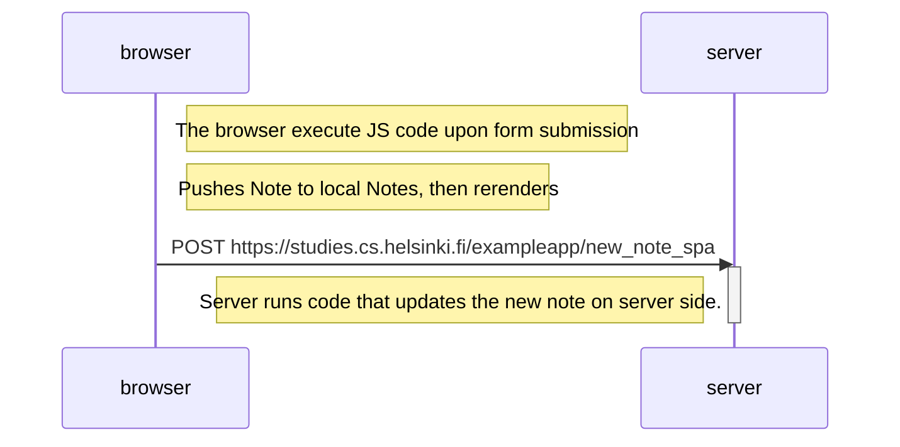

# 0_6

```mermaid
sequenceDiagram
    participant browser
    participant server


    Note right of browser: The browser execute JS code upon form submission
    Note right of browser: Pushes Note to local Notes, then rerenders

    browser ->> server: POST https://studies.cs.helsinki.fi/exampleapp/new_note_spa
    activate server
    Note left of server: Server runs code that updates the new note on server side.
    deactivate server
    
```
